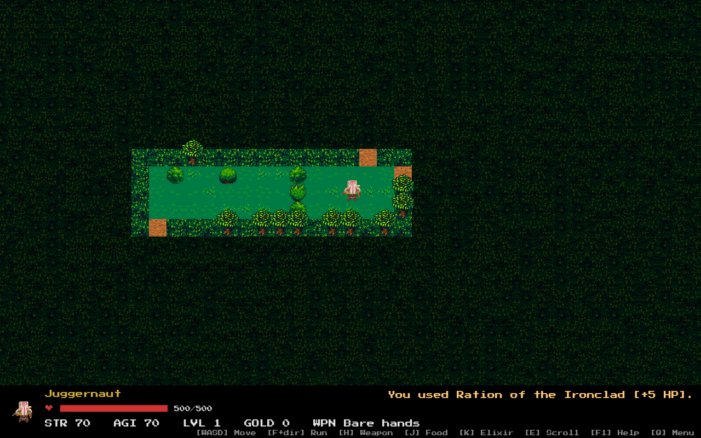
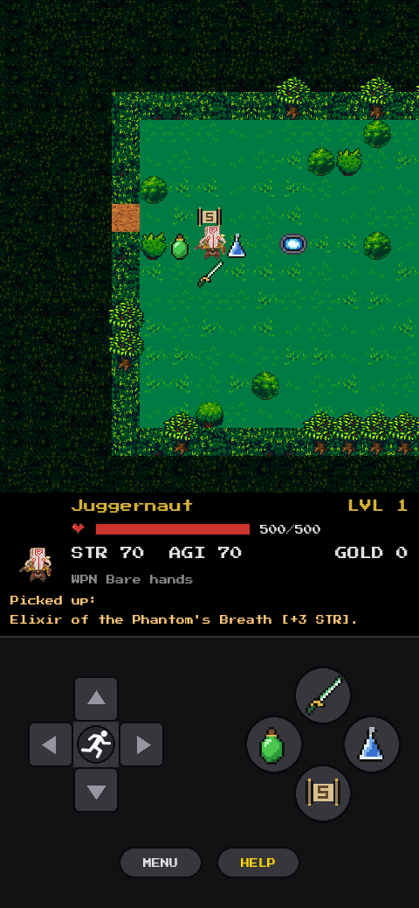
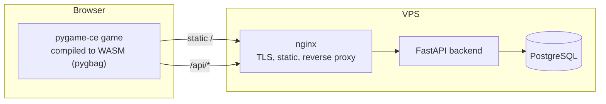

# YurneROGUE

A browser roguelike set in the Dota 2 universe — Python compiled to WebAssembly,
a global leaderboard and a full CI/CD pipeline deploying to a VPS.

**Play in your browser: https://yurnerogue.ru** — desktop and mobile.

[Русская версия](README_RU.md)

| Desktop | Mobile |
|---------|--------|
|  |  |

## About

A sequel to my terminal [rogue](https://github.com/stariydedd/rogue): the same
turn-based dungeon core, rebuilt with a graphical UI and taken to the web.

The Dark Carnival passed through the jungle and did not leave whole: its
creatures stayed and twisted the forest. As Yurnero the Juggernaut you cut
clearings through the thicket and descend twenty-one floors toward the heart of
the Carnival. Every floor is procedurally generated and harder than the last;
every finished run lands on a global leaderboard shared by all players.

Beyond the game itself, this is a DevOps portfolio project: a static WASM
frontend, an API service with a database, TLS, and an automated pipeline from
`git push` to a health-checked production deploy.

## Architecture



The game keeps a layered architecture:

- **`game/domain/`** — game rules and state (session, level generation,
  combat, enemies, items), no dependency on rendering or storage.
- **`game/presentation/`** — `pygame-ce` UI: map tiles, HUD, menus, a state
  machine handling one event per frame, and on-screen touch controls.
- **`game/datalayer/`** — local saves and the leaderboard HTTP client, working
  both natively and inside WASM.
- **`game/main.py`** — entry point with an `asyncio` loop (a pygbag requirement).
- **`backend/`** — FastAPI service: `POST /api/runs`, `GET /api/leaderboard`,
  `GET /api/health`.
- **`infra/`** — Docker Compose stacks and nginx config (TLS, static, proxy).

## CI/CD

1. Push to `main` triggers GitHub Actions.
2. `lint` (ruff) plus game and backend test suites run in parallel.
3. `build-web` compiles the game to WASM with pygbag.
4. `build-backend-image` builds the Docker image and pushes it to GHCR.
5. `deploy` uploads the static build to the VPS over rsync, pulls the new
   backend image, restarts the compose stack, reloads nginx and finishes with
   an HTTPS health check against production.

TLS certificates are issued by Let's Encrypt and renewed automatically by
`certbot.timer`; the renewal hook reloads the dockerized nginx.

## Tech Stack

| Category | Tools |
|----------|-------|
| **Game** | Python 3.12, pygame-ce, pygbag (WASM) |
| **Backend** | FastAPI, SQLAlchemy 2, PostgreSQL 16 |
| **Infrastructure** | Docker Compose, nginx, Let's Encrypt |
| **CI/CD** | GitHub Actions, GitHub Container Registry |

## Features

- 21 procedurally generated jungle floors with fog of war and a camera that
  follows the player.
- 5 recognizable Dota heroes as enemies, each with distinct behavior.
- Items and buffs, plus the classic run command (`F` + direction) that follows
  corridor turns and stops at room entrances.
- Global leaderboard with a local fallback when the server is unreachable.
- Mobile version: a retro-console portrait layout with a d-pad (run button in
  the center), item buttons and contextual SELECT/MENU keys.
- All graphics are pixel-art PNGs in `game/assets/custom/` — no sprite atlas.

## Controls

| Key | Action |
|-----|--------|
| `W A S D` / arrows | Move |
| `F` + direction | Run until an obstacle |
| `H` | Weapon |
| `J` | Food |
| `K` | Elixir |
| `E` | Scroll |
| `F1` | Help |
| `Q` | Back to menu |

In item menus select with digits or arrows + `Enter`.

On touch devices the game switches to a portrait console layout: d-pad for
movement and menu navigation with a run button in its center, a four-button
diamond for items (weapon / food / elixir / scroll), `SELECT` to confirm
(`HELP` in game, `USE` in item menus) and `MENU` to cancel or exit. The player
name is asked via the browser prompt; the help screen closes with a tap.

## Enemies

| Enemy | Behavior |
|-------|----------|
| **Pudge** | Slow and tough. Wanders randomly. |
| **Bloodseeker** | Steals max HP on hit (1/10 per strike). Deflects the player's first attack. Moves in 8 directions. |
| **Riki** | Blinks around the room, mostly invisible (20% chance to appear per turn, always visible while chasing). |
| **Axe** | Moves 2 tiles per turn. Rests after attacking, then counterattacks. His strikes cannot be dodged. |
| **Skywrath Mage** | Moves and attacks diagonally. Hits may put the player to sleep (15%). |

Enemy stats grow with each floor while useful items become rarer.

## Items

| Item | Effect |
|------|--------|
| Food | Restores health. |
| Elixir | Temporary buff to strength, agility or max HP for 20 turns. |
| Scroll | Permanent buff to one stat. |
| Weapon | Equipped via `H`; the previous weapon drops nearby. |
| Treasure | Credited for slain enemies; determines leaderboard rank. |

Items are picked up by stepping on them; the backpack holds up to 9 items of
each type. The exit is a glowing portal — descending after floor 21 wins the
run, and the result (death or victory) is submitted to the global leaderboard.

## Local development

```
python -m venv .venv
.venv\Scripts\Activate.ps1                        # Windows
pip install -r requirements.txt

python game/main.py                               # native desktop window
python -m pytest tests                            # game tests (headless SDL)

python -m pygbag --build --ume_block 0 --template web/rogue.tmpl --title "YurneROGUE" game
                                                  # WASM build -> game/build/web

docker compose -f infra/docker-compose.yml up     # backend + PostgreSQL on :8000
cd backend && python -m pytest tests              # backend tests
```

The native game works fully offline — the leaderboard falls back to local
records when the server is unreachable.

## Project structure

```
yurnerogue/
├── game/
│   ├── main.py            # asyncio entry point (pygbag)
│   ├── domain/            # game rules and state (no rendering deps)
│   ├── presentation/      # pygame-ce UI, state machine, touch controls
│   ├── datalayer/         # saves + leaderboard client (native/WASM)
│   └── assets/            # fonts and pixel art (custom/)
├── backend/               # FastAPI leaderboard service + its tests
├── infra/                 # docker-compose stacks, nginx (TLS)
├── web/                   # pygbag HTML template, favicon
├── tests/                 # game tests (pygame headless)
├── docs/screenshots/      # images used in this README
└── .github/workflows/     # CI/CD pipeline
```

## Assets

Hero sprites and item icons are fan-made pixel art (Dota 2 © Valve, used as
non-commercial fan content); third-party fonts and tiles are listed in
[game/assets/LICENSE.txt](game/assets/LICENSE.txt).
