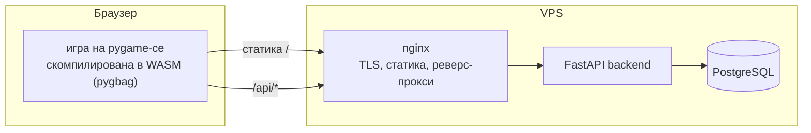

# YurneROGUE

Браузерный рогалик во вселенной Dota 2 — Python, скомпилированный в
WebAssembly, глобальный лидерборд и полный CI/CD-пайплайн с деплоем на VPS.

**Играть в браузере: https://yurnerogue.ru** — на десктопе и телефоне.

[English version](README.md)

| Десктоп | Мобильная версия |
|---------|------------------|
|  |  |

## О проекте

Продолжение моего терминального [rogue](https://github.com/stariydedd/rogue):
то же пошаговое ядро подземелья, пересобранное с графическим интерфейсом и
вынесенное в веб.

Тёмный Карнавал прошёл через джунгли и не ушёл целиком: его твари остались и
исказили лес. За Юрнеро-Джаггернаута ты прорубаешь поляны в чаще и спускаешься
на двадцать один круг вниз, к сердцу Карнавала. Каждый уровень генерируется
процедурно и сложнее предыдущего; каждый завершённый забег попадает в общий
для всех игроков лидерборд.

Помимо самой игры это DevOps-портфолио: статический WASM-фронтенд, API-сервис
с базой данных, TLS и автоматический пайплайн от `git push` до продакшен-деплоя
с health-check'ом.

## Архитектура



Игра построена на слоистой архитектуре:

- **`game/domain/`** — правила и состояние игры (сессия, генерация уровней,
  бой, враги, предметы), не зависит от отрисовки и хранения.
- **`game/presentation/`** — интерфейс на `pygame-ce`: тайлы карты, HUD, меню,
  конечный автомат состояний (одно событие за кадр) и экранные тач-кнопки.
- **`game/datalayer/`** — локальные сохранения и HTTP-клиент лидерборда,
  работающий и нативно, и внутри WASM.
- **`game/main.py`** — точка входа с `asyncio`-циклом (требование pygbag).
- **`backend/`** — сервис на FastAPI: `POST /api/runs`, `GET /api/leaderboard`,
  `GET /api/health`.
- **`infra/`** — Docker Compose и конфиг nginx (TLS, статика, прокси).

## CI/CD

1. Push в `main` запускает GitHub Actions.
2. Параллельно проходят `lint` (ruff) и тесты игры и бэкенда.
3. `build-web` компилирует игру в WASM через pygbag.
4. `build-backend-image` собирает Docker-образ и пушит его в GHCR.
5. `deploy` заливает статику на VPS по rsync, подтягивает новый образ бэкенда,
   перезапускает compose-стек, перечитывает конфиг nginx и завершается
   HTTPS-проверкой здоровья продакшена.

TLS-сертификаты выпускает Let's Encrypt, продлевает их `certbot.timer`;
хук продления перезагружает nginx в докере.

## Технологии

| Категория | Инструменты |
|-----------|-------------|
| **Игра** | Python 3.12, pygame-ce, pygbag (WASM) |
| **Бэкенд** | FastAPI, SQLAlchemy 2, PostgreSQL 16 |
| **Инфраструктура** | Docker Compose, nginx, Let's Encrypt |
| **CI/CD** | GitHub Actions, GitHub Container Registry |

## Возможности

- 21 процедурно генерируемый уровень джунглей, туман войны, камера за игроком.
- 5 узнаваемых героев Доты в роли врагов, у каждого своё поведение.
- Предметы и баффы, классический бег (`F` + направление) — следует поворотам
  коридора и останавливается у входа в комнату.
- Глобальный лидерборд с локальным фолбэком, если сервер недоступен.
- Мобильная версия: портретная раскладка в стиле ретро-консоли — крестовина
  с кнопкой бега в центре, ромб кнопок предметов, контекстные SELECT/MENU.
- Вся графика — пиксель-арт PNG в `game/assets/custom/`, без атласов.

## Управление

| Клавиша | Действие |
|---------|----------|
| `W A S D` / стрелки | Движение |
| `F` + направление | Бег до препятствия |
| `H` | Оружие |
| `J` | Еда |
| `K` | Эликсир |
| `E` | Свиток |
| `F1` | Справка |
| `Q` | Возврат в меню |

В меню предметов выбор — цифрами или стрелками + `Enter`.

На тач-устройствах включается портретная консольная раскладка: крестовина —
движение и навигация по меню, в её центре — бег; ромб из четырёх кнопок —
предметы (оружие / еда / эликсир / свиток); `SELECT` — подтверждение (в игре —
`HELP`, в списке предметов — `USE`), `MENU` — отмена или выход. Имя для
лидерборда запрашивает системный диалог браузера, справка закрывается тапом.

## Противники

| Враг | Поведение |
|------|-----------|
| **Pudge** | Медлительный и живучий. Ходит случайно. |
| **Bloodseeker** | При ударе крадёт максимум здоровья (1/10 за удар). Первая атака игрока по нему отражается. Ходит по 8 направлениям. |
| **Riki** | Блинкует в пределах комнаты, большую часть времени невидим (появляется с шансом 20% за ход, при погоне виден всегда). |
| **Axe** | Ходит на 2 клетки за ход. После атаки отдыхает, затем контратакует. От его удара нельзя увернуться. |
| **Skywrath Mage** | Ходит и бьёт по диагонали. Удар с шансом 15% усыпляет. |

С каждым уровнем характеристики врагов растут, а полезных предметов меньше.

## Предметы

| Предмет | Эффект |
|---------|--------|
| Еда | Восстанавливает здоровье. |
| Эликсир | Временный бафф к силе, ловкости или максимуму HP на 20 ходов. |
| Свиток | Постоянный бафф к одной из характеристик. |
| Оружие | Экипируется через `H`; прежнее оружие падает рядом. |
| Сокровища | Начисляются за убитых врагов; определяют место в лидерборде. |

Предметы подбираются при наступании; рюкзак вмещает до 9 предметов каждого
типа. Выход — светящийся портал: спуск после 21-го уровня — победа, результат
забега (смерть или победа) отправляется в глобальный лидерборд.

## Локальная разработка

```
python -m venv .venv
.venv\Scripts\Activate.ps1                        # Windows
pip install -r requirements.txt

python game/main.py                               # нативное окно
python -m pytest tests                            # тесты игры (headless SDL)

python -m pygbag --build --ume_block 0 --template web/rogue.tmpl --title "YurneROGUE" game
                                                  # WASM-сборка -> game/build/web

docker compose -f infra/docker-compose.yml up     # бэкенд + PostgreSQL на :8000
cd backend && python -m pytest tests              # тесты бэкенда
```

Нативная игра полностью работает офлайн — при недоступном сервере лидерборд
переключается на локальные рекорды.

## Структура проекта

```
yurnerogue/
├── game/
│   ├── main.py            # точка входа с asyncio (pygbag)
│   ├── domain/            # правила и состояние игры (без зависимостей от UI)
│   ├── presentation/      # pygame-ce UI, конечный автомат, тач-кнопки
│   ├── datalayer/         # сохранения + клиент лидерборда (натив/WASM)
│   └── assets/            # шрифты и пиксель-арт (custom/)
├── backend/               # FastAPI-сервис лидерборда + его тесты
├── infra/                 # docker-compose, nginx (TLS)
├── web/                   # HTML-шаблон pygbag, favicon
├── tests/                 # тесты игры (pygame headless)
├── docs/screenshots/      # изображения для README
└── .github/workflows/     # CI/CD-пайплайн
```

## Ассеты

Спрайты героев и иконки предметов — фанатский пиксель-арт (Dota 2 © Valve,
некоммерческий фан-контент); сторонние шрифты и тайлы перечислены в
[game/assets/LICENSE.txt](game/assets/LICENSE.txt).
